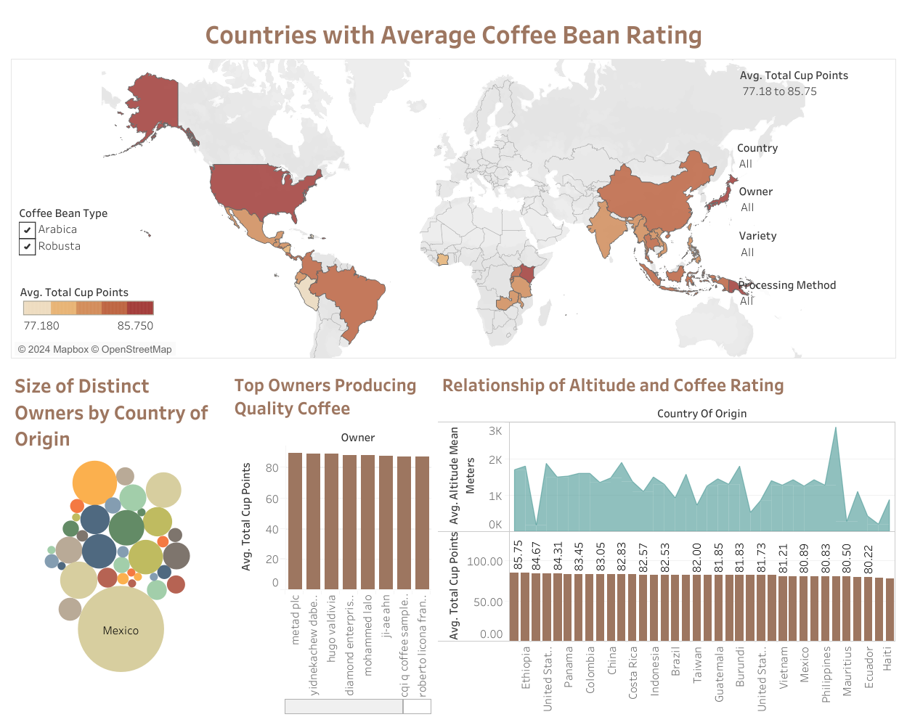

# Ask Phase


### Business Task

#### Objective
To optimize the quality of coffee production for the Coffee Quality Institute that sources both Arabica and Robusta beans through:

* Identifying the key quality factors most significantly contributing to the overall quality of the coffee beans.
* Comparison of Arabica and Robusta beans. Are there specific characteristics that make one type of coffee bean consistently score higher than the other?
* Careful inspection if there are specific countries of origin that consistently produce higher-quality coffee beans.
* Evaluation of Owner's producing higher-quality coffee beans.
* Assessing whether the altitude at which coffee is grown has an impact on quality.
* Providing recommendation for the Institute's sourcing strategy.

### Key Stakeholders
* Coffee Quality Institute (CQI): a non-profit organization dedicated to improving the quality of coffee and the lives of the people that produce it. Established in 1996, CQI works with the global coffee community, including farmers, producers, and industry stakeholders.
* Farmers: individuals engaged in the cultivation of coffee.

### Dataset
The dataset was obtained through the [GitHub](https://github.com/jldbc/coffee-quality-database) Repo of James LeDoux. He obtained the dataset from the database of CQI through a scraper.


# Prepare Phase


### Data Source:
The dataset was obtained from the Coffee Quality Institute's website in January 2018 using a scraping method. It comprises four CSV files, two of which contain uncleaned raw data sourced directly from the website. Given that the raw data were manually recorded with varying encodings, abbreviations, and units of measurement for fields such as farm names, altitude, region, and others, it is necessary to perform data cleaning to enhance the accuracy of the analysis. The dataset encompasses quality measures and farmers' information for two types of coffee beans: arabica and robusta.

### Limitation:
* The dataset is from January 2018, potentially missing recent improvements in coffee quality due to changes in farming practices.
* The dataset focuses on only arabica and robusta beans, limiting generalizability to other coffee varieties.
* Overrepresentation of certain regions or farm types could introduce bias into the analysis.
* The dataset lacks information on changes in coffee bean quality over time, hindering trend assessment.

### Future Exploration:
To overcome limitations in the dataset, addressing the variability constraint in bean types can be achieved by collecting additional datasets covering a wider range of coffee varieties, through collaboration with other coffee institutions. The 2018 dataset can be alleviated by implementing data collection from the  recent data of the Coffee Quality Institute.


# Process Phase

### Initial pass-through in spreadsheet
* The column header in the 'robusta_data_cleaned.csv' file has been updated to align with the column header of the 'arabica_data_cleaned.csv' file to ensure a seamless merging process in R without any complications.
* Aligned the columns in 'robusta_data_cleaned.csv' to match the column sequence of 'arabica_data_cleaned.csv' to facilitate a seamless merging process.
* Reviewed and rectified data entry errors by employing the sort and filter feature. This effort aims to ensure data integrity before proceeding with further analysis.
* Used conditional formatting feature to check data entry errors. 
* Standardized the formatting of cells containing numerical values to ensure appropriate format for the analysis.

### Transformation and Exploration of data with R

1. Implemented installation and loading of essential packages as part of the initial steps in the configuration of the environment.

```{r, results = 'hide' }
install.packages("tidyverse")
library(tidyverse)
library(janitor)
```

2. Imported datasets from csv files

```{r}
arabica_cleaned_data <- read.csv("arabica_data_cleaned.csv")
robusta_cleaned_data <- read.csv("robusta_data_cleaned.csv")
```

3. Conducted exploration from both dataframes to gain familiarity and identify key variables essential for subsequent analysis.

```{r, results = 'hide'}
str(arabica_cleaned_data)
str(robusta_cleaned_data)
summary(arabica_cleaned_data)
summary(robusta_cleaned_data)
head(arabica_cleaned_data)
head(robusta_cleaned_data)
```

4. Assessing the column index for each variable to identify and filter out non-significant features as part of the data analysis process.

```{r, results = 'hide'}
print(data.frame(Column_Name = names(arabica_cleaned_data)))
print(data.frame(Column_Name = names(robusta_cleaned_data)))
```

5. Dropping unrelated variables in each data frames. 

```{r results = 'hide'}
arabica_trimmed_data <- arabica_cleaned_data %>%
  select(-1, -6, -8, -10, -13, -14, -15, -16, -37, -38, -39, -40, -41)

robusta_trimmed_data <- robusta_cleaned_data %>%
  select(-1, -6, -8, -10, -13, -14, -15, -16, -37, -38, -39, -40, -41)
```

#### List of variables dropped:
               Column_Name            Reason for dropping the variable
             
                         X            This column contains just column numbers
                Lot.Number            Irrelevant for analysis
                ICO.Number            Irrelevant for analysis
                  Altitude            A Range. Has been separated for more accuracy
            Number.of.Bags            No significance to the analysis
                Bag.Weight            No significance to the analysis
        In.Country.Partner            No significance to the analysis
              Harvest.Year            Dropped, as grading date is more accurate
                Expiration            Irrelevant for analysis
        Certification.Body            Irrelevant for analysis
     Certification.Address            Irrelevant for analysis
     Certification.Contact            Irrelevant for analysis
       unit_of_measurement            Irrelevant for analysis

6. Examining missing values to assess their potential impact on the subsequent analysis.

```{r}
sum(is.na(arabica_trimmed_data))
sum(is.na(robusta_trimmed_data))
```
Given the substantial number of missing values, especially in the altitude variable of the dataset, I decided against removing those rows. This choice is intended to prevent the unintentional deletion of relevant information, ensuring the accuracy of my analysis.

7. Conducting an assessment for duplicate values

```{r}
sum(duplicated(arabica_trimmed_data))
sum(duplicated(robusta_trimmed_data))
```

It revealed the absence of any duplications in both data frames.

8. Aligning variable names for uniformity to enhance readability and facilitate easier coding.

```{r results = 'hide'}
arabica_trimmed_data <- janitor::clean_names(arabica_trimmed_data)
robusta_trimmed_data <- janitor::clean_names(robusta_trimmed_data)
print(data.frame(Column_Name = names(arabica_trimmed_data)))
print(data.frame(Column_Name = names(robusta_trimmed_data)))
```

9. Identification and handling of potential outliers that can skew the result of the analysis

```{r arabica_trimmed_data through descriptive statistics}
min(arabica_trimmed_data$total_cup_points)
mean(arabica_trimmed_data$total_cup_points)
max(arabica_trimmed_data$total_cup_points)
```

```{r robusta_trimmed_data through descriptive statistics}
min(robusta_trimmed_data$total_cup_points)
mean(robusta_trimmed_data$total_cup_points)
max(robusta_trimmed_data$total_cup_points)
```

10. Utilizing visualization tools for the purpose of outlier identification.

```{r message = FALSE}
ggplot(data = arabica_trimmed_data) +
  geom_histogram(mapping = aes(x = total_cup_points, fill = "Brown")) +
  labs(
    title = "Histogram of Arabica Total Cup Points",
    x = "Total Cup Points",
    y = "Count of Beans"
  )
```

```{r message = FALSE}
ggplot(data = robusta_trimmed_data) +
  geom_histogram(mapping = aes(x = total_cup_points, fill = "Brown")) +
  labs(
    title = "Histogram of Robusta Total Cup Points",
    x = "Total Cup Points",
    y = "Count of Beans"
  )
```

Upon identifying outliers, I focused into the data to investigate the root causes and determine whether they should be retained or removed. This examination aims to provide understanding for informed decision-making in subsequent analyses.

11. Removing an outlier attributed to potential data entry error.

Upon review, it appears that one bean was scored incorrectly, receiving a score of zero due to an incomplete assessment. Consequently, I have opted to exclude it from the dataset to prevent potential distortion of the analysis results.

```{r}
arabica_trimmed_data <- arabica_trimmed_data %>%
  filter(total_cup_points > 0)
```

12. To dig deeper into the analysis, I decided to change the date from strings to a proper date format. But, some dates had words like "th" in them, like "April 4th, 2016." So, I used a package called 'stringr' to capture only the numbers and then changed it into a proper date format using another package called 'lubridate.'.

```{r Convert date for arabica_trimmed_data}
arabica_trimmed_data$grading_date <-
  mdy(str_replace_all(arabica_trimmed_data$grading_date,
                      "\\b(\\d+)th\\b", "\\1"))
```

```{r Convert date for robusta_trimmed_data}
robusta_trimmed_data$grading_date <-
  mdy(str_replace_all(robusta_trimmed_data$grading_date,
                      "\\b(\\d+)th\\b", "\\1"))
```

13. Combining both data frames in preparation for the overall analysis 

```{r}
combined_coffee_data <- rbind(arabica_trimmed_data, robusta_trimmed_data)
```

14. Exporting csv file for safe keeping and further analysis

```{r}
write.csv(arabica_trimmed_data, "arabica_trimmed_data.csv", row.names = FALSE)
write.csv(robusta_trimmed_data, "robusta_trimmed_data.csv", row.names = FALSE)
write.csv(combined_coffee_data, "combined_coffee_data.csv", row.names = FALSE)
```


# Analysis Phase

### Preparation of the environment for analysis
So that I can transform data from wide to long format, I installed the reshape2 package.

```{r, results = 'hide'}
install.packages("reshape2")
library(reshape2)
```

### TASK 1: Identification of Key Quality Factor of a Coffee Bean
To identify the key quality factors significantly influencing the overall quality of a coffee bean, I employed correlation calculations between the sensory values of the coffee bean and the total cup points.

I decided to compare correlation between aroma, flavor, aftertaste, acidity, body, balance, uniformity, clean cup, sweetness, cupper points and total cup points. This will be applied to arabica, robusta and their combined data for further analysis.

```{r}
arabica_correlation_matrix <-
  cor(arabica_trimmed_data[, c(13:22, 23)])

robusta_correlation_matrix <-
  cor(robusta_trimmed_data[, c(13:22, 23)])

combined_correlation_matrix <-
  cor(combined_coffee_data[, c(13:22, 23)])
```

Melted correlation matrix for the 3 dataframes for visualization purposes

```{r}
arabica_melted_correlation <- melt(arabica_correlation_matrix)
robusta_melted_correlation <- melt(robusta_correlation_matrix)
combined_melted_correlation <- melt(combined_correlation_matrix)
```

To gain a deeper understanding of the data, I chose to visualize it using a heatmap. This allowed me to examine the strength of the correlation between each sensory value and the total cup points.

```{r}
ggplot(arabica_melted_correlation) +
  geom_tile(mapping = aes(Var1, Var2, fill = value), color = "white") +
  geom_text(aes(Var1, Var2, label = paste0(round(value * 100), "%")),
            size = 3) +
  labs(title = "Arabica Correlation Heatmap") +
  scale_fill_gradient2(low = "blue", high = "red", mid = "white",
                       midpoint = 0, limit = c(-1, 1), space = "Lab",
                       name = "Correlation") +
  theme_minimal() +
  theme(axis.text.x = element_text(angle = 45, vjust = 1, size = 10, hjust = 1))
```

```{r}
ggplot(robusta_melted_correlation) +
  geom_tile(mapping = aes(Var1, Var2, fill = value), color = "white") +
  geom_text(aes(Var1, Var2, label = paste0(round(value * 100), "%")),
            size = 3) +
  labs(title = "Robusta Correlation Heatmap") +
  scale_fill_gradient2(low = "blue", high = "red", mid = "white",
                       midpoint = 0, limit = c(-1, 1), space = "Lab",
                       name = "Correlation") +
  theme_minimal() +
  theme(axis.text.x = element_text(angle = 45, vjust = 1, size = 10, hjust = 1))
```

```{r}
ggplot(combined_melted_correlation) +
  geom_tile(mapping = aes(Var1, Var2, fill = value), color = "white") +
  geom_text(aes(Var1, Var2, label = paste0(round(value * 100), "%")),
            size = 3) +
  labs(title = "Arabica & Robusta Correlation Heatmap") +
  scale_fill_gradient2(low = "blue", high = "red", mid = "white",
                       midpoint = 0, limit = c(-1, 1), space = "Lab",
                       name = "Correlation") +
  theme_minimal() +
  theme(axis.text.x = element_text(angle = 45, vjust = 1, size = 10, hjust = 1))
```

### TASK 2: Analysis on the key difference between Arabica and Robusta
I calculated the mean values of each sensory quality for Arabica and Robusta beans, enabling a side-by-side comparison through visualization. Subsequently, results were consolidated into a single dataframe and were melted.

```{r message = FALSE}
mean_arabica <- colMeans(arabica_trimmed_data[, 13:22], na.rm = TRUE)
mean_robusta <- colMeans(robusta_trimmed_data[, 13:22], na.rm = TRUE)

mean_sensory_values <- data.frame(
  Attribute = names(mean_arabica),
  Arabica = mean_arabica,
  Robusta = mean_robusta
)

melted_mean_sensory <- melt(mean_sensory_values)

ggplot(data = melted_mean_sensory) +
  geom_bar(mapping = aes(x = Attribute, y = value, fill = variable),
           stat = "identity", position = "dodge", color = "white") +
  labs(title = "Comparison of Mean Sensory Attributes: Arabica vs Robusta",
       y = "Mean Value",
       x = "Sensory Attribute",
       fill = "Species") +
  theme_minimal() +
  theme(axis.text.x =  element_text(angle = 45, vjust = 1, size = 10,
                                    hjust = 1))
```

### TASK 3: Checking what countries that consistently produce higher-quality beans
To determine the leading producers of high-quality coffee, I computed the average total cup points for each country.

```{r}
arabica_quality_country <-
  aggregate(arabica_trimmed_data[, 13:23],
            by = list(country = arabica_trimmed_data$country_of_origin),
            FUN = mean)

robusta_quality_country <-
  aggregate(robusta_trimmed_data[, 13:23],
            by = list(country = robusta_trimmed_data$country_of_origin),
            FUN = mean)

combined_quality_country <-
  aggregate(combined_coffee_data[, 13:23],
            by = list(country = combined_coffee_data$country_of_origin),
            FUN = mean)

arabica_quality_country <-
  arabica_quality_country[order(-arabica_quality_country$total_cup_points), ]

robusta_quality_country <-
  robusta_quality_country[order(-robusta_quality_country$total_cup_points), ]

combined_quality_country <-
  combined_quality_country[order(-combined_quality_country$total_cup_points), ]
```

Following the calculation of average total cup points for each country, I proceeded to create a bar graph for a visual representation of the top-performing countries.

```{r}
# for arabica
ggplot(data = arabica_quality_country) +
  geom_bar(mapping = aes(x = reorder(country, -total_cup_points),
                         y = total_cup_points),
           stat = "identity", fill = "red") +
  labs(title = "Top Quality Producing Countries for Arabica",
       x = "Country of Origin",
       y = "Average Total Cup Points") +
  theme(axis.text.x = element_text(angle = 45, hjust = 1))

# for robusta
ggplot(data = robusta_quality_country) +
  geom_bar(mapping = aes(x = reorder(country, -total_cup_points),
                         y = total_cup_points),
           stat = "identity", fill = "red") +
  labs(title = "Top Quality Producing Countries for Robusta",
       x = "Country of Origin",
       y = "Average Total Cup Points") +
  theme(axis.text.x = element_text(angle = 45, hjust = 1))

# for combined data:
ggplot(data = combined_quality_country) +
  geom_bar(mapping = aes(x = reorder(country, -total_cup_points),
                         y = total_cup_points),
           stat = "identity", fill = "red") +
  labs(title = "Top Overall Quality Coffee Producing Countries",
       x = "Country of Origin",
       y = "Average Total Cup Points") +
  theme(axis.text.x = element_text(angle = 45, hjust = 1))
```

### TASK 4: Identifying Top Owners based on Top Countries

To identify the leading coffee producers within specific countries, I filtered the data frames for Arabica, focusing on the United States, Papua New Guinea, Ethiopia, Japan, and Kenya. Subsequently, I organized the results in descending order based on the mean total cup points. However, to gain insights into consistent high-quality coffee production by species, I chose to extract the top 10 owners irrespective of their respective countries.

```{r message = FALSE}
# Filtering the data based on the top countries producing arabica
filtered_arabica_country <- c("United States", "Papua New Guinea",
                              "Ethiopia", "Japan", "Kenya")

# Grouping owners by country
grouped_owners_arabica <- arabica_trimmed_data %>%
  filter(country_of_origin %in% filtered_arabica_country) %>%
  group_by(owner, country_of_origin) %>%
  summarise(mean_total_cup_points = mean(total_cup_points, na.rm = TRUE)) %>%
  arrange(-mean_total_cup_points)

grouped_owners_robusta <- robusta_trimmed_data %>%
  group_by(owner, country_of_origin) %>%
  summarise(mean_total_cup_points = mean(total_cup_points, na.rm = TRUE)) %>%
  arrange(-mean_total_cup_points)

# Identifying top 10 owners that produces quality coffee bean
top_owners_arabica <- head(grouped_owners_arabica, 10)
top_owners_robusta <- head(grouped_owners_robusta, 10)

print(top_owners_arabica)
print(top_owners_robusta)
```

I utilized a bar graph for a visual examination of the top 10 coffee owners for each coffee bean specie.

```{r}
# top 10 coffee owners for arabica
ggplot(data = top_owners_arabica) +
  geom_bar(mapping = aes(x = reorder(owner, -mean_total_cup_points),
                         y = mean_total_cup_points,
                         fill = country_of_origin),
           stat = "identity") +
  labs(title = "Top 10 Owners that Produce Quality Arabica Beans",
       x = "Name of Owner",
       y = "Average Total Cup Points") +
  theme(axis.text.x = element_text(angle = 45, hjust = 1))
```

```{r}
# top 10 coffee owners for robusta
ggplot(data = top_owners_robusta) +
  geom_bar(mapping = aes(x = reorder(owner, -mean_total_cup_points),
                         y = mean_total_cup_points,
                         fill = country_of_origin),
           stat = "identity", position = "dodge") +
  labs(title = "Top 10 Owners that Produce Quality Robusta Beans",
       x = "Name of Owner",
       y = "Average Total Cup Points") +
  theme(axis.text.x = element_text(angle = 60, hjust = 1))
```

### TASK 5: Assessing whether the altitude at which coffee is grown has an impact on quality

In order to analyze the potential impact of altitude on the overall quality of a coffee bean, I calculated the correlation between all sensory values and the average altitude.

```{r}
# Calculating correlation between sensory values and altitude
altitude_correlation_arabica <-
  cor(na.omit(arabica_trimmed_data[, c(13:23, 31)]))

altitude_correlation_robusta <-
  cor(na.omit(robusta_trimmed_data[, c(13:23, 31)]))

# Melting data frame for use in ggplot
melted_altitude_arabica <- melt(altitude_correlation_arabica)
melted_altitude_robusta <- melt(altitude_correlation_robusta)
```

To visually explore the correlation between sensory values and average altitude, I created a heatmap.

```{r}
ggplot(melted_altitude_arabica) +
  geom_tile(mapping = aes(Var1, Var2, fill = value), color = "white") +
  geom_text(aes(Var1, Var2, label = paste0(round(value * 100), "%")),
            size = 3) +
  labs(title = "Heatmap: Sensory Values vs Average Altitude - Arabica") +
  scale_fill_gradient2(low = "blue", high = "red", mid = "white",
                       midpoint = 0, limit = c(-1, 1), space = "Lab",
                       name = "Correlation") +
  theme_minimal() +
  theme(axis.text.x = element_text(angle = 45, vjust = 1, size = 10, hjust = 1))


ggplot(melted_altitude_robusta) +
  geom_tile(mapping = aes(Var1, Var2, fill = value), color = "white") +
  geom_text(aes(Var1, Var2, label = paste0(round(value * 100), "%")),
            size = 3) +
  labs(title = "Heatmap: Sensory Values vs Average Altitude - Robusta") +
  scale_fill_gradient2(low = "blue", high = "red", mid = "white",
                       midpoint = 0, limit = c(-1, 1), space = "Lab",
                       name = "Correlation") +
  theme_minimal() +
  theme(axis.text.x = element_text(angle = 45, vjust = 1, size = 10, hjust = 1))
```

To have other insights, I decided to visualize it through a scatterplot
```{r warning = FALSE}
# for arabica
ggplot(data = arabica_trimmed_data) +
  geom_point(mapping = aes(x = total_cup_points, y = altitude_mean_meters)) +
  labs(title = "Scatterplot of Total Cup Points vs Average Altitude (Arabica)",
       x = "Total Cup Points",
       y = "Average Altitude")

# for robusta
ggplot(data = robusta_trimmed_data) +
  geom_point(mapping = aes(x = total_cup_points, y = altitude_mean_meters)) +
  labs(title = "Scatterplot of Total Cup Points vs Average Altitude (Robusta)",
       x = "Total Cup Points",
       y = "Average Altitude")
```

Following the analysis of the scatterplot results, I further examined the altitude ranges associated with the top 5 countries for both Arabica and Robusta. This additional investigation provides valuable insights into the elevation preferences associated with the production of high-quality coffee in these regions.

```{r}
# Analyzing what range of altitude does the top quality producing countries have
grouped_altitude_arabica <- arabica_trimmed_data %>%
  filter(country_of_origin %in% filtered_arabica_country) %>%
  group_by(country_of_origin) %>%
  summarise(AvgAltLow = mean(altitude_low_meters, na.rm = TRUE),
            AvgAltHigh = mean(altitude_high_meters, na.rm = TRUE),
            mean_total_cup_points = mean(total_cup_points, na.rm = TRUE)) %>%
  arrange(-mean_total_cup_points)

grouped_altitude_robusta <- robusta_trimmed_data %>%
  group_by(country_of_origin) %>%
  summarise(AvgAltLow = mean(altitude_low_meters, na.rm = TRUE),
            AvgAltHigh = mean(altitude_high_meters, na.rm = TRUE),
            mean_total_cup_points = mean(total_cup_points, na.rm = TRUE)) %>%
  arrange(-mean_total_cup_points)

print(grouped_altitude_arabica)
print(grouped_altitude_robusta)
```


# Share Phase

### Business Task 1: Identifying the key quality factors most significantly contributing to the overall quality of the coffee beans.

To know why coffee beans are good or bad, we must first understand what makes them that way:

1.  Aroma         -Smell of dry coffee, wet coffee at crust break, and wet coffee as it steeps
2.  Flavor        -Mid-range notes in between first impression and aftertaste
3.  Aftertaste    -Length and quality of enjoyable flavor after the coffee is swallowed
4.  Acidity       -Brightness (Good), Sour (Bad)
5.  Body          -Tactile feeling between tongue and mouth
6.  Balance       -Balance of flavor, aftertaste, body and acidity
7.  Uniformity    -Consistency of flavor across cups
8.  Clean cup     -Lacking negative taste from the beginning to end of taste
9.  Sweetness     -Sugary flavor (Good), Astringency flavor (Bad)
10. Cupper points -Holistic score by Cupper

The analysis reveals that there are 3 most crucial sensory aspects for coffee bean quality. These three factors are interconnected, meaning changes in one affect the others, directly impacting the overall quality. Interestingly, having high Sweetness doesn't guarantee a good cup of coffee; what truly matters in the end is the combination of Flavor, Aftertaste, and Balance. In conclusion, understanding the relationship between this 3 factors is key to assessing the overall quality of coffee beans.

```{r, echo = FALSE}
ggplot(combined_melted_correlation) +
  geom_tile(mapping = aes(Var1, Var2, fill = value), color = "white") +
  geom_text(aes(Var1, Var2, label = paste0(round(value * 100), "%")),
            size = 3) +
  labs(title = "Arabica & Robusta Correlation Heatmap") +
  scale_fill_gradient2(low = "blue", high = "red", mid = "white",
                       midpoint = 0, limit = c(-1, 1), space = "Lab",
                       name = "Correlation") +
  theme_minimal() +
  theme(axis.text.x = element_text(angle = 45, vjust = 1, size = 10, hjust = 1))
```

### Business Task 2: Comparison of Arabica and Robusta beans. Are there specific characteristics that make one type of coffee bean consistently score higher than the other?

In nearly all sensory aspects, both arabica and robusta show similar results. The main difference lies in arabica having notably higher sweetness points. However, robusta scores slightly higher in other aspects, with a minimal margin compared to arabica. Upon closer examination of the data, it seems this could be due to arabica having a larger sample size and a wider range of ratings. Despite these nuances, the overall difference is not substantial, and they are nearly identical.

```{r, echo = FALSE}
ggplot(data = melted_mean_sensory) +
  geom_bar(mapping = aes(x = Attribute, y = value, fill = variable),
           stat = "identity", position = "dodge", color = "white") +
  labs(title = "Comparison of Mean Sensory Attributes: Arabica vs Robusta",
       y = "Mean Value",
       x = "Sensory Attribute",
       fill = "Species") +
  theme_minimal() +
  theme(axis.text.x =  element_text(angle = 45, vjust = 1, size = 10,
                                    hjust = 1))
```

### Business Task 3: Careful inspection if there are specific countries of origin that consistently produce higher-quality coffee beans.

The top Arabica-producing countries are headed by the United States, followed by Papua New Guinea, Ethiopia, Japan, and Kenya. Interestingly, India, despite securing the least favorable rating for Arabica, achieves the 2nd position for Robusta production. This intriguing contrast suggests a potential avenue for future exploration to understand the underlying factors influencing quality and production in India for both Arabica and Robusta coffee varieties.

For Robusta, the leading countries are Uganda, India, Ecuador, the United States, and Vietnam. When considering the combined production of Arabica and Robusta, Papua New Guinea emerges as the consistent top performer, followed by Ethiopia, Japan, the United States, and Kenya.

```{r, echo = FALSE}
# for arabica
ggplot(data = arabica_quality_country) +
  geom_bar(mapping = aes(x = reorder(country, -total_cup_points),
                         y = total_cup_points),
           stat = "identity", fill = "red") +
  labs(title = "Top Quality Producing Countries for Arabica",
       x = "Country of Origin",
       y = "Average Total Cup Points") +
  theme(axis.text.x = element_text(angle = 45, hjust = 1))

# for robusta
ggplot(data = robusta_quality_country) +
  geom_bar(mapping = aes(x = reorder(country, -total_cup_points),
                         y = total_cup_points),
           stat = "identity", fill = "red") +
  labs(title = "Top Quality Producing Countries for Robusta",
       x = "Country of Origin",
       y = "Average Total Cup Points") +
  theme(axis.text.x = element_text(angle = 45, hjust = 1))

# for combined data:
ggplot(data = combined_quality_country) +
  geom_bar(mapping = aes(x = reorder(country, -total_cup_points),
                         y = total_cup_points),
           stat = "identity", fill = "red") +
  labs(title = "Top Overall Quality Coffee Producing Countries",
       x = "Country of Origin",
       y = "Average Total Cup Points") +
  theme(axis.text.x = element_text(angle = 45, hjust = 1))
```


### Business Task 4: Evaluation of Owner's producing higher-quality coffee beans.

The top owners producing higher quality Arabica coffee beans showcase a notable concentration in Ethiopia, with companies like Metad PLC, Yidnekachew Dabessa, Diamond Enterprise PLC, and Mohammed Lalo securing the leading positions. This suggests a distinct prominence of Ethiopian coffee growers in consistently delivering high-quality Arabica beans.

```{r, echo = FALSE}
ggplot(data = top_owners_arabica) +
  geom_bar(mapping = aes(x = reorder(owner, -mean_total_cup_points),
                         y = mean_total_cup_points,
                         fill = country_of_origin),
           stat = "identity") +
  labs(title = "Top 10 Owners that Produce Quality Arabica Beans",
       x = "Name of Owner",
       y = "Average Total Cup Points") +
  theme(axis.text.x = element_text(angle = 45, hjust = 1))
```

On the other hand, the top owners in Robusta coffee production highlight Uganda's excelence, with organizations such as Katuka Development Trust, Ankole Coffee Producers Coop., Ugacof, and Kasozi Coffee Farmers Association securing top positions. Notably, Nishant Gurjer from India also stands out among the top Robusta producers.

```{r, echo = FALSE}
ggplot(data = top_owners_robusta) +
  geom_bar(mapping = aes(x = reorder(owner, -mean_total_cup_points),
                         y = mean_total_cup_points,
                         fill = country_of_origin),
           stat = "identity", position = "dodge") +
  labs(title = "Top 10 Owners that Produce Quality Robusta Beans",
       x = "Name of Owner",
       y = "Average Total Cup Points") +
  theme(axis.text.x = element_text(angle = 60, hjust = 1))
```


### Business Task 5:  Assessing whether the altitude at which coffee is grown has an impact on quality.

The correlation analysis between overall coffee quality rating and the altitude of coffee bean plantations reveals relatively low correlations of 0.15 for Arabica and 0.31 for Robusta. Despite the numerical correlation being modest, a pattern emerges from the scatterplot, indicating that coffee beans planted at altitudes between 1000 to 2000 meters tend to exhibit higher quality ratings, particularly in the 81 to 85 range.

```{r, echo = FALSE}
ggplot(melted_altitude_arabica) +
  geom_tile(mapping = aes(Var1, Var2, fill = value), color = "white") +
  geom_text(aes(Var1, Var2, label = paste0(round(value * 100), "%")),
            size = 3) +
  labs(title = "Heatmap: Sensory Values vs Average Altitude - Arabica") +
  scale_fill_gradient2(low = "blue", high = "red", mid = "white",
                       midpoint = 0, limit = c(-1, 1), space = "Lab",
                       name = "Correlation") +
  theme_minimal() +
  theme(axis.text.x = element_text(angle = 45, vjust = 1, size = 10, hjust = 1))


ggplot(melted_altitude_robusta) +
  geom_tile(mapping = aes(Var1, Var2, fill = value), color = "white") +
  geom_text(aes(Var1, Var2, label = paste0(round(value * 100), "%")),
            size = 3) +
  labs(title = "Heatmap: Sensory Values vs Average Altitude - Robusta") +
  scale_fill_gradient2(low = "blue", high = "red", mid = "white",
                       midpoint = 0, limit = c(-1, 1), space = "Lab",
                       name = "Correlation") +
  theme_minimal() +
  theme(axis.text.x = element_text(angle = 45, vjust = 1, size = 10, hjust = 1))
```

```{r, echo = FALSE, warning = FALSE}
ggplot(data = arabica_trimmed_data) +
  geom_point(mapping = aes(x = total_cup_points, y = altitude_mean_meters)) +
  labs(title = "Scatterplot of Total Cup Points vs Average Altitude (Arabica)",
       x = "Total Cup Points",
       y = "Average Altitude")

ggplot(data = robusta_trimmed_data) +
  geom_point(mapping = aes(x = total_cup_points, y = altitude_mean_meters)) +
  labs(title = "Scatterplot of Total Cup Points vs Average Altitude (Robusta)",
       x = "Total Cup Points",
       y = "Average Altitude")
```

To validate this pattern, I examined the average elevation of top Arabica and Robusta-producing countries, finding a consistent range of 1300 to 1900 meters. However, exceptions exist, as evidenced by Japan's high-rated Arabica beans cultivated at 170 meters and Ecuador's Robusta Coffee, which thrives at just 40 meters altitude. This suggests that while the general trend shows a preference for higher altitudes, exceptional coffee beans with high ratings can still be found at lower elevations.

```{r, echo = FALSE}
print(grouped_altitude_arabica)
print(grouped_altitude_robusta)
```

### Visualization Dashboard (Tableau)
I've created a visualization dashboard on Tableau to provide a detailed view and support the findings of the analysis mentioned earlier. This interactive dashboard enables you to filter and explore specific details about the types of coffee beans. You can access the live dashboard through the following [link](https://public.tableau.com/app/profile/derrick.adrian.payas/viz/CoffeeCaseStudy_17055896164740/Dashboard1).




# Act Phase
Based on the analysis, the Coffee Quality Institute (CQI) could refine its sourcing strategy in several ways:

* **Focus on Flavor, Aftertaste, and Balance:** Prioritize the selection of coffee beans based on Flavor, Aftertaste, and Balance, recognizing that these factors significantly contribute to overall quality.
* **Consider Preferences Over Bean Type:** Acknowledge that Arabica and Robusta beans exhibit similar overall quality, with nuanced differences. Recognize that sweetness alone does not determine a higher quality cup. Tailoring sourcing decisions based on consumer preferences, whether for Arabica or Robusta, becomes essential.
* **Explore Varied Origins:** While certain countries consistently produce high-quality beans, explore the intriguing contrast seen in India, which ranks low for Arabica but excels in Robusta. Consider this as an opportunity for in-depth exploration into the factors influencing quality and production in diverse regions.
* **Recognize Top Owners per Bean Specie:** Recognize the significant presence of leading Arabica producers in Ethiopia and notable Robusta producers in Uganda. Highlight the exceptional performance of specific owners such as Metad PLC and Katuka Development Trust. Explore the possibility of cultivating strong relationships with these owners to ensure a reliable and steady supply of high-quality coffee beans.
* **Altitude Consideration and Flexibility:** Note the modest correlation between altitude and coffee quality, with a preference for beans grown between 1000 to 2000 meters. However, maintain flexibility as exceptions exist, such as Japan's high-rated Arabica beans grown at 170 meters and Ecuador's Robusta thriving at 40 meters. While a general preference for higher altitudes exists, recognize exceptional beans at lower elevations.
* **Future Exploration:** It would be nice to conduct a thorough examination into the potential influence of coffee bean varieties on quality. Similarly, explore the direct impact of different processing methods on overall coffee bean quality. We should also consider tracking the latest updates in the Coffee Quality Institute (CQI) Database to compare results from both historical and recent assessments. This comparative analysis will offer a more understanding of the evolving trends in coffee quality over time.


