# Ask Phase

### Business Task

#### Objective

To optimize the quality of coffee production for the Coffee Quality
Institute that sources both Arabica and Robusta beans through:

- Identifying the key quality factors most significantly contributing to
  the overall quality of the coffee beans.
- Comparison of Arabica and Robusta beans. Are there specific
  characteristics that make one type of coffee bean consistently score
  higher than the other?
- Careful inspection if there are specific countries of origin that
  consistently produce higher-quality coffee beans.
- Evaluation of Owner’s producing higher-quality coffee beans.
- Assessing whether the altitude at which coffee is grown has an impact
  on quality.
- Providing recommendation for the Institute’s sourcing strategy.

### Key Stakeholders

- Coffee Quality Institute (CQI): a non-profit organization dedicated to
  improving the quality of coffee and the lives of the people that
  produce it. Established in 1996, CQI works with the global coffee
  community, including farmers, producers, and industry stakeholders.
- Farmers: individuals engaged in the cultivation of coffee.

### Dataset

The dataset was obtained through the
[GitHub](https://github.com/jldbc/coffee-quality-database) Repo of James
LeDoux. He obtained the dataset from the database of CQI through a
scraper.

# Prepare Phase

### Data Source:

The dataset was obtained from the Coffee Quality Institute’s website in
January 2018 using a scraping method. It comprises four CSV files, two
of which contain uncleaned raw data sourced directly from the website.
Given that the raw data were manually recorded with varying encodings,
abbreviations, and units of measurement for fields such as farm names,
altitude, region, and others, it is necessary to perform data cleaning
to enhance the accuracy of the analysis. The dataset encompasses quality
measures and farmers’ information for two types of coffee beans: arabica
and robusta.

### Limitation:

- The dataset is from January 2018, potentially missing recent
  improvements in coffee quality due to changes in farming practices.
- The dataset focuses on only arabica and robusta beans, limiting
  generalizability to other coffee varieties.
- Overrepresentation of certain regions or farm types could introduce
  bias into the analysis.
- The dataset lacks information on changes in coffee bean quality over
  time, hindering trend assessment.

### Future Exploration:

To overcome limitations in the dataset, addressing the variability
constraint in bean types can be achieved by collecting additional
datasets covering a wider range of coffee varieties, through
collaboration with other coffee institutions. The 2018 dataset can be
alleviated by implementing data collection from the recent data of the
Coffee Quality Institute.

# Process Phase

### Initial pass-through in spreadsheet

- The column header in the ‘robusta_data_cleaned.csv’ file has been
  updated to align with the column header of the
  ‘arabica_data_cleaned.csv’ file to ensure a seamless merging process
  in R without any complications.
- Aligned the columns in ‘robusta_data_cleaned.csv’ to match the column
  sequence of ‘arabica_data_cleaned.csv’ to facilitate a seamless
  merging process.
- Reviewed and rectified data entry errors by employing the sort and
  filter feature. This effort aims to ensure data integrity before
  proceeding with further analysis.
- Used conditional formatting feature to check data entry errors.
- Standardized the formatting of cells containing numerical values to
  ensure appropriate format for the analysis.

### Transformation and Exploration of data with R

1.  Implemented installation and loading of essential packages as part
    of the initial steps in the configuration of the environment.

``` r
install.packages("tidyverse")
library(tidyverse)
library(janitor)
```

2.  Imported datasets from csv files

``` r
arabica_cleaned_data <- read.csv("arabica_data_cleaned.csv")
robusta_cleaned_data <- read.csv("robusta_data_cleaned.csv")
```

3.  Conducted exploration from both dataframes to gain familiarity and
    identify key variables essential for subsequent analysis.

``` r
str(arabica_cleaned_data)
str(robusta_cleaned_data)
summary(arabica_cleaned_data)
summary(robusta_cleaned_data)
head(arabica_cleaned_data)
head(robusta_cleaned_data)
```

4.  Assessing the column index for each variable to identify and filter
    out non-significant features as part of the data analysis process.

``` r
print(data.frame(Column_Name = names(arabica_cleaned_data)))
print(data.frame(Column_Name = names(robusta_cleaned_data)))
```

5.  Dropping unrelated variables in each data frames.

``` r
arabica_trimmed_data <- arabica_cleaned_data %>%
  select(-1, -6, -8, -10, -13, -14, -15, -16, -37, -38, -39, -40, -41)

robusta_trimmed_data <- robusta_cleaned_data %>%
  select(-1, -6, -8, -10, -13, -14, -15, -16, -37, -38, -39, -40, -41)
```

#### List of variables dropped:

               Column_Name            Reason for dropping the variable
             
                         X            This column contains just column numbers
                Lot.Number            Irrelevant for analysis
                ICO.Number            Irrelevant for analysis
                  Altitude            A Range. Has been separated for more accuracy
            Number.of.Bags            No significance to the analysis
                Bag.Weight            No significance to the analysis
        In.Country.Partner            No significance to the analysis
              Harvest.Year            Dropped, as grading date is more accurate
                Expiration            Irrelevant for analysis
        Certification.Body            Irrelevant for analysis
     Certification.Address            Irrelevant for analysis
     Certification.Contact            Irrelevant for analysis
       unit_of_measurement            Irrelevant for analysis

6.  Examining missing values to assess their potential impact on the
    subsequent analysis.

``` r
sum(is.na(arabica_trimmed_data))
```

    ## [1] 682

``` r
sum(is.na(robusta_trimmed_data))
```

    ## [1] 9

Given the substantial number of missing values, especially in the
altitude variable of the dataset, I decided against removing those rows.
This choice is intended to prevent the unintentional deletion of
relevant information, ensuring the accuracy of my analysis.

7.  Conducting an assessment for duplicate values

``` r
sum(duplicated(arabica_trimmed_data))
```

    ## [1] 0

``` r
sum(duplicated(robusta_trimmed_data))
```

    ## [1] 0

It revealed the absence of any duplications in both data frames.

8.  Aligning variable names for uniformity to enhance readability and
    facilitate easier coding.

``` r
arabica_trimmed_data <- janitor::clean_names(arabica_trimmed_data)
robusta_trimmed_data <- janitor::clean_names(robusta_trimmed_data)
print(data.frame(Column_Name = names(arabica_trimmed_data)))
print(data.frame(Column_Name = names(robusta_trimmed_data)))
```

9.  Identification and handling of potential outliers that can skew the
    result of the analysis

``` r
min(arabica_trimmed_data$total_cup_points)
```

    ## [1] 0

``` r
mean(arabica_trimmed_data$total_cup_points)
```

    ## [1] 82.11593

``` r
max(arabica_trimmed_data$total_cup_points)
```

    ## [1] 90.58

``` r
min(robusta_trimmed_data$total_cup_points)
```

    ## [1] 73.75

``` r
mean(robusta_trimmed_data$total_cup_points)
```

    ## [1] 80.86893

``` r
max(robusta_trimmed_data$total_cup_points)
```

    ## [1] 83.75

10. Utilizing visualization tools for the purpose of outlier
    identification.

``` r
ggplot(data = arabica_trimmed_data) +
  geom_histogram(mapping = aes(x = total_cup_points, fill = "Brown")) +
  labs(
    title = "Histogram of Arabica Total Cup Points",
    x = "Total Cup Points",
    y = "Count of Beans"
  )
```

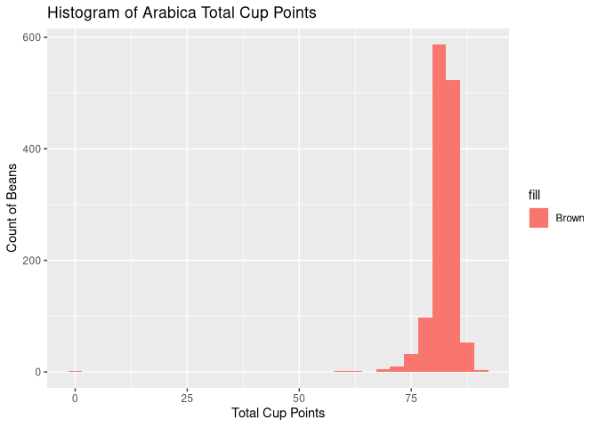<!-- -->

``` r
ggplot(data = robusta_trimmed_data) +
  geom_histogram(mapping = aes(x = total_cup_points, fill = "Brown")) +
  labs(
    title = "Histogram of Robusta Total Cup Points",
    x = "Total Cup Points",
    y = "Count of Beans"
  )
```

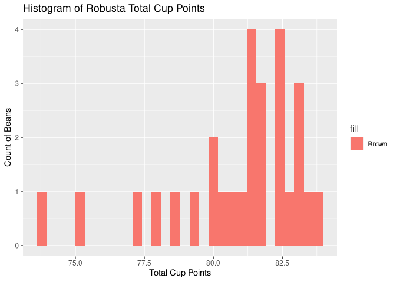<!-- -->

Upon identifying outliers, I focused into the data to investigate the
root causes and determine whether they should be retained or removed.
This examination aims to provide understanding for informed
decision-making in subsequent analyses.

11. Removing an outlier attributed to potential data entry error.

Upon review, it appears that one bean was scored incorrectly, receiving
a score of zero due to an incomplete assessment. Consequently, I have
opted to exclude it from the dataset to prevent potential distortion of
the analysis results.

``` r
arabica_trimmed_data <- arabica_trimmed_data %>%
  filter(total_cup_points > 0)
```

12. To dig deeper into the analysis, I decided to change the date from
    strings to a proper date format. But, some dates had words like “th”
    in them, like “April 4th, 2016.” So, I used a package called
    ‘stringr’ to capture only the numbers and then changed it into a
    proper date format using another package called ‘lubridate.’.

``` r
arabica_trimmed_data$grading_date <-
  mdy(str_replace_all(arabica_trimmed_data$grading_date,
                      "\\b(\\d+)th\\b", "\\1"))
```

``` r
robusta_trimmed_data$grading_date <-
  mdy(str_replace_all(robusta_trimmed_data$grading_date,
                      "\\b(\\d+)th\\b", "\\1"))
```

13. Combining both data frames in preparation for the overall analysis

``` r
combined_coffee_data <- rbind(arabica_trimmed_data, robusta_trimmed_data)
```

14. Exporting csv file for safe keeping and further analysis

``` r
write.csv(arabica_trimmed_data, "arabica_trimmed_data.csv", row.names = FALSE)
write.csv(robusta_trimmed_data, "robusta_trimmed_data.csv", row.names = FALSE)
write.csv(combined_coffee_data, "combined_coffee_data.csv", row.names = FALSE)
```

# Analysis Phase

### Preparation of the environment for analysis

So that I can transform data from wide to long format, I installed the
reshape2 package.

``` r
install.packages("reshape2")
library(reshape2)
```

### TASK 1: Identification of Key Quality Factor of a Coffee Bean

To identify the key quality factors significantly influencing the
overall quality of a coffee bean, I employed correlation calculations
between the sensory values of the coffee bean and the total cup points.

I decided to compare correlation between aroma, flavor, aftertaste,
acidity, body, balance, uniformity, clean cup, sweetness, cupper points
and total cup points. This will be applied to arabica, robusta and their
combined data for further analysis.

``` r
arabica_correlation_matrix <-
  cor(arabica_trimmed_data[, c(13:22, 23)])

robusta_correlation_matrix <-
  cor(robusta_trimmed_data[, c(13:22, 23)])

combined_correlation_matrix <-
  cor(combined_coffee_data[, c(13:22, 23)])
```

Melted correlation matrix for the 3 dataframes for visualization
purposes

``` r
arabica_melted_correlation <- melt(arabica_correlation_matrix)
robusta_melted_correlation <- melt(robusta_correlation_matrix)
combined_melted_correlation <- melt(combined_correlation_matrix)
```

To gain a deeper understanding of the data, I chose to visualize it
using a heatmap. This allowed me to examine the strength of the
correlation between each sensory value and the total cup points.

``` r
ggplot(arabica_melted_correlation) +
  geom_tile(mapping = aes(Var1, Var2, fill = value), color = "white") +
  geom_text(aes(Var1, Var2, label = paste0(round(value * 100), "%")),
            size = 3) +
  labs(title = "Arabica Correlation Heatmap") +
  scale_fill_gradient2(low = "blue", high = "red", mid = "white",
                       midpoint = 0, limit = c(-1, 1), space = "Lab",
                       name = "Correlation") +
  theme_minimal() +
  theme(axis.text.x = element_text(angle = 45, vjust = 1, size = 10, hjust = 1))
```

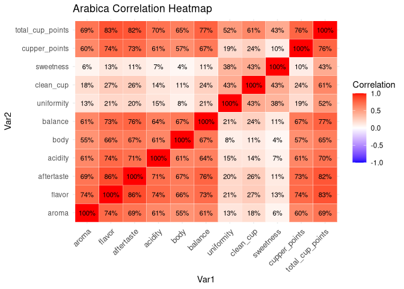<!-- -->

``` r
ggplot(robusta_melted_correlation) +
  geom_tile(mapping = aes(Var1, Var2, fill = value), color = "white") +
  geom_text(aes(Var1, Var2, label = paste0(round(value * 100), "%")),
            size = 3) +
  labs(title = "Robusta Correlation Heatmap") +
  scale_fill_gradient2(low = "blue", high = "red", mid = "white",
                       midpoint = 0, limit = c(-1, 1), space = "Lab",
                       name = "Correlation") +
  theme_minimal() +
  theme(axis.text.x = element_text(angle = 45, vjust = 1, size = 10, hjust = 1))
```

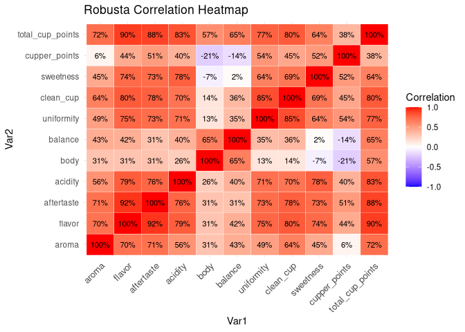<!-- -->

``` r
ggplot(combined_melted_correlation) +
  geom_tile(mapping = aes(Var1, Var2, fill = value), color = "white") +
  geom_text(aes(Var1, Var2, label = paste0(round(value * 100), "%")),
            size = 3) +
  labs(title = "Arabica & Robusta Correlation Heatmap") +
  scale_fill_gradient2(low = "blue", high = "red", mid = "white",
                       midpoint = 0, limit = c(-1, 1), space = "Lab",
                       name = "Correlation") +
  theme_minimal() +
  theme(axis.text.x = element_text(angle = 45, vjust = 1, size = 10, hjust = 1))
```

<!-- -->

### TASK 2: Analysis on the key difference between Arabica and Robusta

I calculated the mean values of each sensory quality for Arabica and
Robusta beans, enabling a side-by-side comparison through visualization.
Subsequently, results were consolidated into a single dataframe and were
melted.

``` r
mean_arabica <- colMeans(arabica_trimmed_data[, 13:22], na.rm = TRUE)
mean_robusta <- colMeans(robusta_trimmed_data[, 13:22], na.rm = TRUE)

mean_sensory_values <- data.frame(
  Attribute = names(mean_arabica),
  Arabica = mean_arabica,
  Robusta = mean_robusta
)

melted_mean_sensory <- melt(mean_sensory_values)

ggplot(data = melted_mean_sensory) +
  geom_bar(mapping = aes(x = Attribute, y = value, fill = variable),
           stat = "identity", position = "dodge", color = "white") +
  labs(title = "Comparison of Mean Sensory Attributes: Arabica vs Robusta",
       y = "Mean Value",
       x = "Sensory Attribute",
       fill = "Species") +
  theme_minimal() +
  theme(axis.text.x =  element_text(angle = 45, vjust = 1, size = 10,
                                    hjust = 1))
```

<!-- -->

### TASK 3: Checking what countries that consistently produce higher-quality beans

To determine the leading producers of high-quality coffee, I computed
the average total cup points for each country.

``` r
arabica_quality_country <-
  aggregate(arabica_trimmed_data[, 13:23],
            by = list(country = arabica_trimmed_data$country_of_origin),
            FUN = mean)

robusta_quality_country <-
  aggregate(robusta_trimmed_data[, 13:23],
            by = list(country = robusta_trimmed_data$country_of_origin),
            FUN = mean)

combined_quality_country <-
  aggregate(combined_coffee_data[, 13:23],
            by = list(country = combined_coffee_data$country_of_origin),
            FUN = mean)

arabica_quality_country <-
  arabica_quality_country[order(-arabica_quality_country$total_cup_points), ]

robusta_quality_country <-
  robusta_quality_country[order(-robusta_quality_country$total_cup_points), ]

combined_quality_country <-
  combined_quality_country[order(-combined_quality_country$total_cup_points), ]
```

Following the calculation of average total cup points for each country,
I proceeded to create a bar graph for a visual representation of the
top-performing countries.

``` r
# for arabica
ggplot(data = arabica_quality_country) +
  geom_bar(mapping = aes(x = reorder(country, -total_cup_points),
                         y = total_cup_points),
           stat = "identity", fill = "red") +
  labs(title = "Top Quality Producing Countries for Arabica",
       x = "Country of Origin",
       y = "Average Total Cup Points") +
  theme(axis.text.x = element_text(angle = 45, hjust = 1))
```

<!-- -->

``` r
# for robusta
ggplot(data = robusta_quality_country) +
  geom_bar(mapping = aes(x = reorder(country, -total_cup_points),
                         y = total_cup_points),
           stat = "identity", fill = "red") +
  labs(title = "Top Quality Producing Countries for Robusta",
       x = "Country of Origin",
       y = "Average Total Cup Points") +
  theme(axis.text.x = element_text(angle = 45, hjust = 1))
```

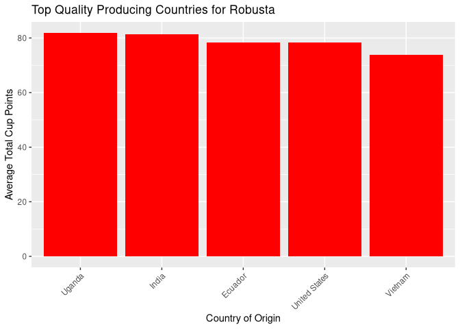<!-- -->

``` r
# for combined data:
ggplot(data = combined_quality_country) +
  geom_bar(mapping = aes(x = reorder(country, -total_cup_points),
                         y = total_cup_points),
           stat = "identity", fill = "red") +
  labs(title = "Top Overall Quality Coffee Producing Countries",
       x = "Country of Origin",
       y = "Average Total Cup Points") +
  theme(axis.text.x = element_text(angle = 45, hjust = 1))
```

<!-- -->

### TASK 4: Identifying Top Owners based on Top Countries

To identify the leading coffee producers within specific countries, I
filtered the data frames for Arabica, focusing on the United States,
Papua New Guinea, Ethiopia, Japan, and Kenya. Subsequently, I organized
the results in descending order based on the mean total cup points.
However, to gain insights into consistent high-quality coffee production
by species, I chose to extract the top 10 owners irrespective of their
respective countries.

``` r
# Filtering the data based on the top countries producing arabica
filtered_arabica_country <- c("United States", "Papua New Guinea",
                              "Ethiopia", "Japan", "Kenya")

# Grouping owners by country
grouped_owners_arabica <- arabica_trimmed_data %>%
  filter(country_of_origin %in% filtered_arabica_country) %>%
  group_by(owner, country_of_origin) %>%
  summarise(mean_total_cup_points = mean(total_cup_points, na.rm = TRUE)) %>%
  arrange(-mean_total_cup_points)

grouped_owners_robusta <- robusta_trimmed_data %>%
  group_by(owner, country_of_origin) %>%
  summarise(mean_total_cup_points = mean(total_cup_points, na.rm = TRUE)) %>%
  arrange(-mean_total_cup_points)

# Identifying top 10 owners that produces quality coffee bean
top_owners_arabica <- head(grouped_owners_arabica, 10)
top_owners_robusta <- head(grouped_owners_robusta, 10)

print(top_owners_arabica)
```

    ## # A tibble: 10 × 3
    ## # Groups:   owner [10]
    ##    owner                     country_of_origin mean_total_cup_points
    ##    <chr>                     <chr>                             <dbl>
    ##  1 metad plc                 Ethiopia                           89.8
    ##  2 yidnekachew dabessa       Ethiopia                           89  
    ##  3 diamond enterprise plc    Ethiopia                           88.2
    ##  4 mohammed lalo             Ethiopia                           88.1
    ##  5 cqi q coffee sample repr… United States                      87.3
    ##  6 ji-ae ahn                 Ethiopia                           87.1
    ##  7 hider abamecha            Ethiopia                           86.2
    ##  8 lusso lab                 Kenya                              86  
    ##  9 ibrahim hussien speciali… Ethiopia                           85.8
    ## 10 colbran coffeelands, ltd. Papua New Guinea                   85.8

``` r
print(top_owners_robusta)
```

    ## # A tibble: 10 × 3
    ## # Groups:   owner [9]
    ##    owner                     country_of_origin mean_total_cup_points
    ##    <chr>                     <chr>                             <dbl>
    ##  1 katuka development trust… Uganda                             83  
    ##  2 ankole coffee producers … Uganda                             82.6
    ##  3 nishant gurjer            India                              82.5
    ##  4 ugacof                    Uganda                             82.4
    ##  5 andrew hetzel             India                              81.6
    ##  6 kasozi coffee farmers as… Uganda                             81.5
    ##  7 kawacom uganda ltd        Uganda                             80.9
    ##  8 nitubaasa ltd             Uganda                             80.6
    ##  9 mannya coffee project     Uganda                             80.5
    ## 10 andrew hetzel             United States                      79.3

I utilized a bar graph for a visual examination of the top 10 coffee
owners for each coffee bean specie.

``` r
# top 10 coffee owners for arabica
ggplot(data = top_owners_arabica) +
  geom_bar(mapping = aes(x = reorder(owner, -mean_total_cup_points),
                         y = mean_total_cup_points,
                         fill = country_of_origin),
           stat = "identity") +
  labs(title = "Top 10 Owners that Produce Quality Arabica Beans",
       x = "Name of Owner",
       y = "Average Total Cup Points") +
  theme(axis.text.x = element_text(angle = 45, hjust = 1))
```

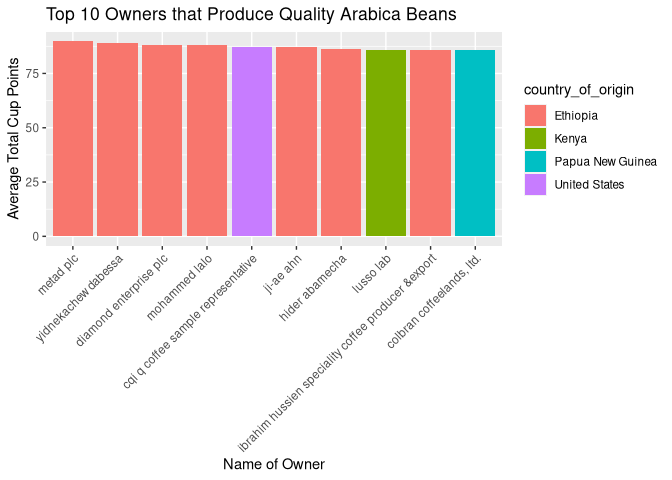<!-- -->

``` r
# top 10 coffee owners for robusta
ggplot(data = top_owners_robusta) +
  geom_bar(mapping = aes(x = reorder(owner, -mean_total_cup_points),
                         y = mean_total_cup_points,
                         fill = country_of_origin),
           stat = "identity", position = "dodge") +
  labs(title = "Top 10 Owners that Produce Quality Robusta Beans",
       x = "Name of Owner",
       y = "Average Total Cup Points") +
  theme(axis.text.x = element_text(angle = 60, hjust = 1))
```

<!-- -->

### TASK 5: Assessing whether the altitude at which coffee is grown has an impact on quality

In order to analyze the potential impact of altitude on the overall
quality of a coffee bean, I calculated the correlation between all
sensory values and the average altitude.

``` r
# Calculating correlation between sensory values and altitude
altitude_correlation_arabica <-
  cor(na.omit(arabica_trimmed_data[, c(13:23, 31)]))

altitude_correlation_robusta <-
  cor(na.omit(robusta_trimmed_data[, c(13:23, 31)]))

# Melting data frame for use in ggplot
melted_altitude_arabica <- melt(altitude_correlation_arabica)
melted_altitude_robusta <- melt(altitude_correlation_robusta)
```

To visually explore the correlation between sensory values and average
altitude, I created a heatmap.

``` r
ggplot(melted_altitude_arabica) +
  geom_tile(mapping = aes(Var1, Var2, fill = value), color = "white") +
  geom_text(aes(Var1, Var2, label = paste0(round(value * 100), "%")),
            size = 3) +
  labs(title = "Heatmap: Sensory Values vs Average Altitude - Arabica") +
  scale_fill_gradient2(low = "blue", high = "red", mid = "white",
                       midpoint = 0, limit = c(-1, 1), space = "Lab",
                       name = "Correlation") +
  theme_minimal() +
  theme(axis.text.x = element_text(angle = 45, vjust = 1, size = 10, hjust = 1))
```

<!-- -->

``` r
ggplot(melted_altitude_robusta) +
  geom_tile(mapping = aes(Var1, Var2, fill = value), color = "white") +
  geom_text(aes(Var1, Var2, label = paste0(round(value * 100), "%")),
            size = 3) +
  labs(title = "Heatmap: Sensory Values vs Average Altitude - Robusta") +
  scale_fill_gradient2(low = "blue", high = "red", mid = "white",
                       midpoint = 0, limit = c(-1, 1), space = "Lab",
                       name = "Correlation") +
  theme_minimal() +
  theme(axis.text.x = element_text(angle = 45, vjust = 1, size = 10, hjust = 1))
```

<!-- -->

To have other insights, I decided to visualize it through a scatterplot

``` r
# for arabica
ggplot(data = arabica_trimmed_data) +
  geom_point(mapping = aes(x = total_cup_points, y = altitude_mean_meters)) +
  labs(title = "Scatterplot of Total Cup Points vs Average Altitude (Arabica)",
       x = "Total Cup Points",
       y = "Average Altitude")
```

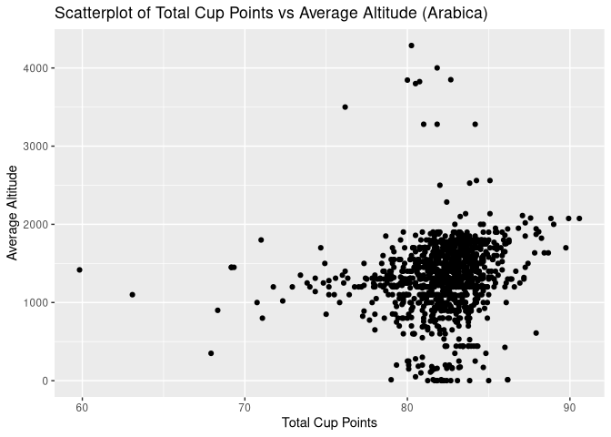<!-- -->

``` r
# for robusta
ggplot(data = robusta_trimmed_data) +
  geom_point(mapping = aes(x = total_cup_points, y = altitude_mean_meters)) +
  labs(title = "Scatterplot of Total Cup Points vs Average Altitude (Robusta)",
       x = "Total Cup Points",
       y = "Average Altitude")
```

<!-- -->

Following the analysis of the scatterplot results, I further examined
the altitude ranges associated with the top 5 countries for both Arabica
and Robusta. This additional investigation provides valuable insights
into the elevation preferences associated with the production of
high-quality coffee in these regions.

``` r
# Analyzing what range of altitude does the top quality producing countries have
grouped_altitude_arabica <- arabica_trimmed_data %>%
  filter(country_of_origin %in% filtered_arabica_country) %>%
  group_by(country_of_origin) %>%
  summarise(AvgAltLow = mean(altitude_low_meters, na.rm = TRUE),
            AvgAltHigh = mean(altitude_high_meters, na.rm = TRUE),
            mean_total_cup_points = mean(total_cup_points, na.rm = TRUE)) %>%
  arrange(-mean_total_cup_points)

grouped_altitude_robusta <- robusta_trimmed_data %>%
  group_by(country_of_origin) %>%
  summarise(AvgAltLow = mean(altitude_low_meters, na.rm = TRUE),
            AvgAltHigh = mean(altitude_high_meters, na.rm = TRUE),
            mean_total_cup_points = mean(total_cup_points, na.rm = TRUE)) %>%
  arrange(-mean_total_cup_points)

print(grouped_altitude_arabica)
```

    ## # A tibble: 5 × 4
    ##   country_of_origin AvgAltLow AvgAltHigh mean_total_cup_points
    ##   <chr>                 <dbl>      <dbl>                 <dbl>
    ## 1 United States         1859.      1859.                  86.0
    ## 2 Papua New Guinea      1700       1700                   85.8
    ## 3 Ethiopia              1702.      1899.                  85.5
    ## 4 Japan                  170        170                   84.7
    ## 5 Kenya                 1466.      1539.                  84.3

``` r
print(grouped_altitude_robusta)
```

    ## # A tibble: 5 × 4
    ##   country_of_origin AvgAltLow AvgAltHigh mean_total_cup_points
    ##   <chr>                 <dbl>      <dbl>                 <dbl>
    ## 1 Uganda                1330.      1380.                  81.9
    ## 2 India                 1422.      1422.                  81.4
    ## 3 Ecuador                 40         40                   78.4
    ## 4 United States         1898.      1898.                  78.2
    ## 5 Vietnam                NaN        NaN                   73.8

# Share Phase

### Business Task 1: Identifying the key quality factors most significantly contributing to the overall quality of the coffee beans.

To know why coffee beans are good or bad, we must first understand what
makes them that way:

1.  Aroma -Smell of dry coffee, wet coffee at crust break, and wet
    coffee as it steeps
2.  Flavor -Mid-range notes in between first impression and aftertaste
3.  Aftertaste -Length and quality of enjoyable flavor after the coffee
    is swallowed
4.  Acidity -Brightness (Good), Sour (Bad)
5.  Body -Tactile feeling between tongue and mouth
6.  Balance -Balance of flavor, aftertaste, body and acidity
7.  Uniformity -Consistency of flavor across cups
8.  Clean cup -Lacking negative taste from the beginning to end of taste
9.  Sweetness -Sugary flavor (Good), Astringency flavor (Bad)
10. Cupper points -Holistic score by Cupper

The analysis reveals that there are 3 most crucial sensory aspects for
coffee bean quality. These three factors are interconnected, meaning
changes in one affect the others, directly impacting the overall
quality. Interestingly, having high Sweetness doesn’t guarantee a good
cup of coffee; what truly matters in the end is the combination of
Flavor, Aftertaste, and Balance. In conclusion, understanding the
relationship between this 3 factors is key to assessing the overall
quality of coffee beans.

<!-- -->

### Business Task 2: Comparison of Arabica and Robusta beans. Are there specific characteristics that make one type of coffee bean consistently score higher than the other?

In nearly all sensory aspects, both arabica and robusta show similar
results. The main difference lies in arabica having notably higher
sweetness points. However, robusta scores slightly higher in other
aspects, with a minimal margin compared to arabica. Upon closer
examination of the data, it seems this could be due to arabica having a
larger sample size and a wider range of ratings. Despite these nuances,
the overall difference is not substantial, and they are nearly
identical.

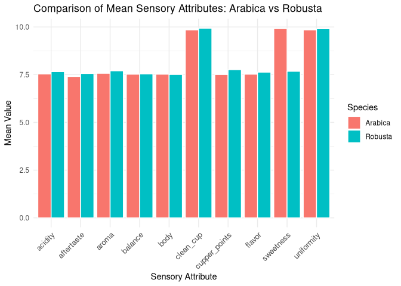<!-- -->

### Business Task 3: Careful inspection if there are specific countries of origin that consistently produce higher-quality coffee beans.

The top Arabica-producing countries are headed by the United States,
followed by Papua New Guinea, Ethiopia, Japan, and Kenya. Interestingly,
India, despite securing the least favorable rating for Arabica, achieves
the 2nd position for Robusta production. This intriguing contrast
suggests a potential avenue for future exploration to understand the
underlying factors influencing quality and production in India for both
Arabica and Robusta coffee varieties.

For Robusta, the leading countries are Uganda, India, Ecuador, the
United States, and Vietnam. When considering the combined production of
Arabica and Robusta, Papua New Guinea emerges as the consistent top
performer, followed by Ethiopia, Japan, the United States, and Kenya.

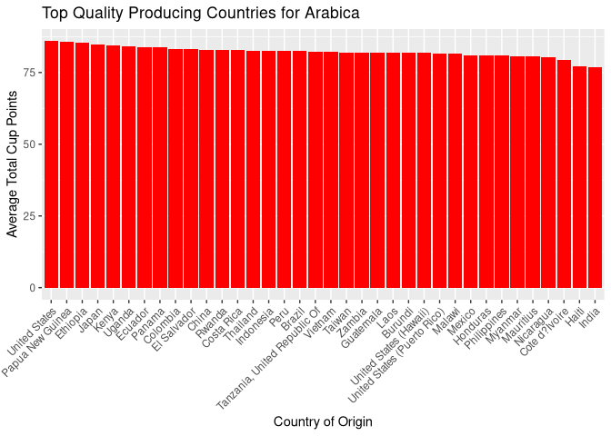<!-- --><!-- -->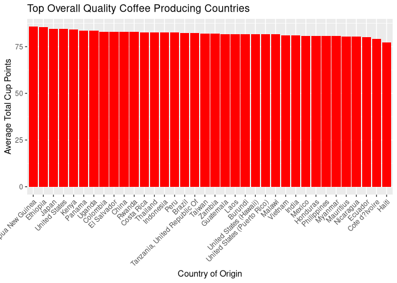<!-- -->

### Business Task 4: Evaluation of Owner’s producing higher-quality coffee beans.

The top owners producing higher quality Arabica coffee beans showcase a
notable concentration in Ethiopia, with companies like Metad PLC,
Yidnekachew Dabessa, Diamond Enterprise PLC, and Mohammed Lalo securing
the leading positions. This suggests a distinct prominence of Ethiopian
coffee growers in consistently delivering high-quality Arabica beans.

<!-- -->

On the other hand, the top owners in Robusta coffee production highlight
Uganda’s excelence, with organizations such as Katuka Development Trust,
Ankole Coffee Producers Coop., Ugacof, and Kasozi Coffee Farmers
Association securing top positions. Notably, Nishant Gurjer from India
also stands out among the top Robusta producers.

<!-- -->

### Business Task 5: Assessing whether the altitude at which coffee is grown has an impact on quality.

The correlation analysis between overall coffee quality rating and the
altitude of coffee bean plantations reveals relatively low correlations
of 0.15 for Arabica and 0.31 for Robusta. Despite the numerical
correlation being modest, a pattern emerges from the scatterplot,
indicating that coffee beans planted at altitudes between 1000 to 2000
meters tend to exhibit higher quality ratings, particularly in the 81 to
85 range.

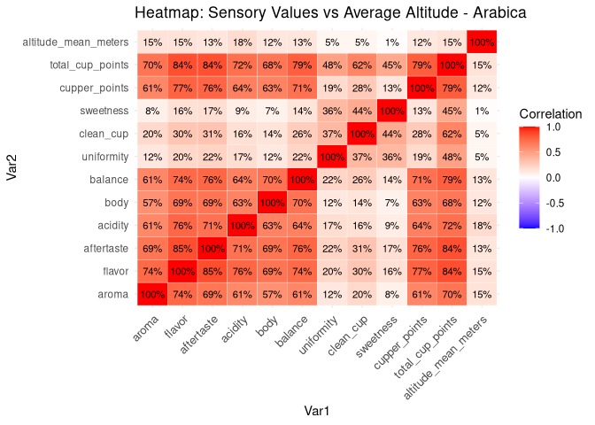<!-- --><!-- -->

<!-- -->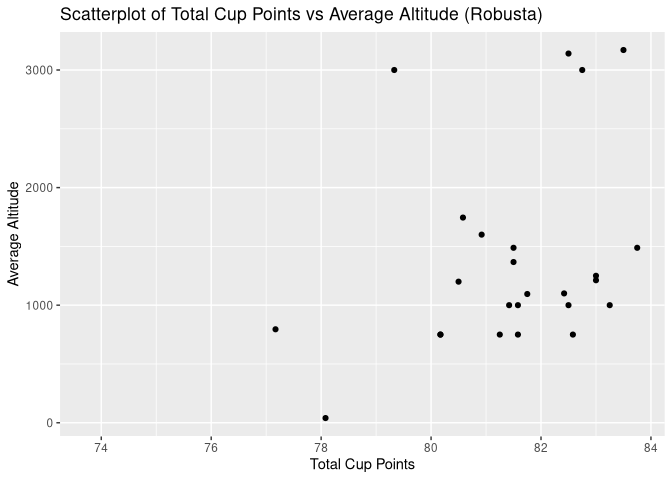<!-- -->

To validate this pattern, I examined the average elevation of top
Arabica and Robusta-producing countries, finding a consistent range of
1300 to 1900 meters. However, exceptions exist, as evidenced by Japan’s
high-rated Arabica beans cultivated at 170 meters and Ecuador’s Robusta
Coffee, which thrives at just 40 meters altitude. This suggests that
while the general trend shows a preference for higher altitudes,
exceptional coffee beans with high ratings can still be found at lower
elevations.

    ## # A tibble: 5 × 4
    ##   country_of_origin AvgAltLow AvgAltHigh mean_total_cup_points
    ##   <chr>                 <dbl>      <dbl>                 <dbl>
    ## 1 United States         1859.      1859.                  86.0
    ## 2 Papua New Guinea      1700       1700                   85.8
    ## 3 Ethiopia              1702.      1899.                  85.5
    ## 4 Japan                  170        170                   84.7
    ## 5 Kenya                 1466.      1539.                  84.3

    ## # A tibble: 5 × 4
    ##   country_of_origin AvgAltLow AvgAltHigh mean_total_cup_points
    ##   <chr>                 <dbl>      <dbl>                 <dbl>
    ## 1 Uganda                1330.      1380.                  81.9
    ## 2 India                 1422.      1422.                  81.4
    ## 3 Ecuador                 40         40                   78.4
    ## 4 United States         1898.      1898.                  78.2
    ## 5 Vietnam                NaN        NaN                   73.8

### Visualization Dashboard (Tableau)

I’ve created a visualization dashboard on Tableau to provide a detailed
view and support the findings of the analysis mentioned earlier. This
interactive dashboard enables you to filter and explore specific details
about the types of coffee beans. You can access the live dashboard
through the following
[link](https://public.tableau.com/app/profile/derrick.adrian.payas/viz/CoffeeCaseStudy_17055896164740/Dashboard1).

<figure>

<figcaption aria-hidden="true">Coffee Case Study Dashboard</figcaption>
</figure>

# Act Phase

Based on the analysis, the Coffee Quality Institute (CQI) could refine
its sourcing strategy in several ways:

- **Focus on Flavor, Aftertaste, and Balance:** Prioritize the selection
  of coffee beans based on Flavor, Aftertaste, and Balance, recognizing
  that these factors significantly contribute to overall quality.
- **Consider Preferences Over Bean Type:** Acknowledge that Arabica and
  Robusta beans exhibit similar overall quality, with nuanced
  differences. Recognize that sweetness alone does not determine a
  higher quality cup. Tailoring sourcing decisions based on consumer
  preferences, whether for Arabica or Robusta, becomes essential.
- **Explore Varied Origins:** While certain countries consistently
  produce high-quality beans, explore the intriguing contrast seen in
  India, which ranks low for Arabica but excels in Robusta. Consider
  this as an opportunity for in-depth exploration into the factors
  influencing quality and production in diverse regions.
- **Recognize Top Owners per Bean Specie:** Recognize the significant
  presence of leading Arabica producers in Ethiopia and notable Robusta
  producers in Uganda. Highlight the exceptional performance of specific
  owners such as Metad PLC and Katuka Development Trust. Explore the
  possibility of cultivating strong relationships with these owners to
  ensure a reliable and steady supply of high-quality coffee beans.
- **Altitude Consideration and Flexibility:** Note the modest
  correlation between altitude and coffee quality, with a preference for
  beans grown between 1000 to 2000 meters. However, maintain flexibility
  as exceptions exist, such as Japan’s high-rated Arabica beans grown at
  170 meters and Ecuador’s Robusta thriving at 40 meters. While a
  general preference for higher altitudes exists, recognize exceptional
  beans at lower elevations.
- **Future Exploration:** It would be nice to conduct a thorough
  examination into the potential influence of coffee bean varieties on
  quality. Similarly, explore the direct impact of different processing
  methods on overall coffee bean quality. We should also consider
  tracking the latest updates in the Coffee Quality Institute (CQI)
  Database to compare results from both historical and recent
  assessments. This comparative analysis will offer a more understanding
  of the evolving trends in coffee quality over time.
